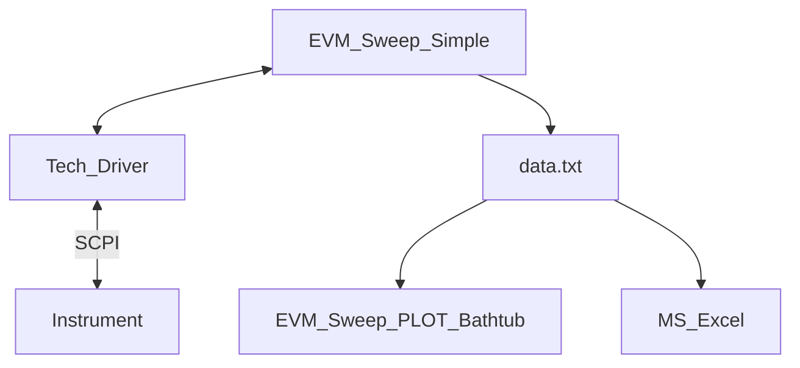

# EVM Sweeps

## Design Goal
- Modular reusable EVM / ACLR bathtub creater
- Use w/ any instrument
- Standarized data output

## Files
- Bench.ini: Contains instrument IP addresses
- EVM_Sweep_Simple.py
  - Contains no SCPI
- EVM_Sweep_PLOT_Bathtub.py
- {tech}_{instr}_meas.py
  - Contains instrument specific SCPI
  - Abstracts instrument & tech for EVM_Sweep_Simple

## Program flow

## Driver details
- {tech}_{instr}_meas.py
  - __init__(self)
  - VSA_Config(self)
  - VSA_get_ACLR(self)
  - VSA_get_attn_reflvl(self)
  - VSA_get_chPwr(self)
  - VSA_get_EVM(self)
  - VSA_get_info(self)
  - VSA_level(self, method='LEV')
  - VSA_Load(self, file)
  - VSA_save_state(self)
  - VSA_sweep(self)
  - VSG_Config(self)
  - VSG_pwr(self, pwr)
  - VSG_save_state(self)
  - VSx_freq(self, freq)
