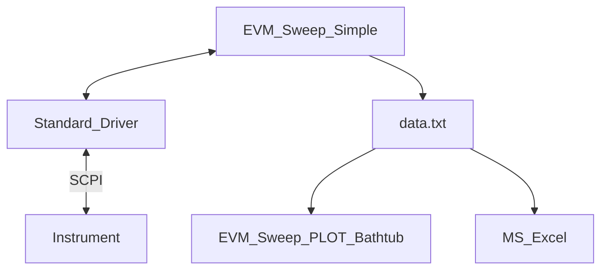

# EVM Sweeps

## Design Goal
- Modular reusable EVM / ACLR bathtub tool
- Use w/ any instrument
- Standarized data output
  - Reuse analysis tools
  - Compare different instruments

## Files
- Bench.ini: Contains instrument IP addresses
- EVM_Sweep_Simple.py
  - Contains no SCPI
- EVM_Sweep_PLOT_Bathtub.py
- **{standard}_{instr}_meas.py**
  - Contains instrument specific SCPI
  - Abstracts instrument & standard for EVM_Sweep_Simple

## Suggested Debug steps
1. Verify bench
   1. Edit IP address in bench.ini
   2. Run bench_config.py to connect
2. Config instruments
   1. Preset instruments
   2. Run VSA_Config() & VSG_Config()
   3. Verify instruments are configured for test
   4. Run & verify
      1. VSx_freq(self, freq)
      2. VSA_level(self)
      3. VSA_sweep(self)
      4. VSA_get_ACLR(self)
      5. VSA_get_EVM(self)
3. Verify EVM_Sweep_Simple()
   1. Preset instrument
   2. Run EVM_Sweep_Simple()
   3. Verify *.txt created w/ data

## Program flow

## Driver details
- {standard}_{instr}_meas.py
  - __init__(self)
  - VSA_Config(self)
  - VSA_get_ACLR(self)
  - VSA_get_attn_reflvl(self)
  - VSA_get_chPwr(self)
  - VSA_get_EVM(self)
  - VSA_get_info(self)
  - VSA_level(self, method='LEV')
  - VSA_Load(self, file)
  - VSA_save_state(self)
  - VSA_sweep(self)
  - VSG_Config(self)
  - VSG_pwr(self, pwr)
  - VSG_save_state(self)
  - VSx_freq(self, freq)

## Typical tests
### 5G FR1 Benchmark COnfig
- Freq: 2; 4; 5; 7GHz
- Pwr : -45 to +5 in 1dB steps
- Wave: 
  - 5G_FR1_UL_30KHz_SCS_100MHz_RFBW_1024QAM
  - 5G_FR1_DL_30KHz_SCS_100MHz_RFBW_1024QAM

### 5G FR2 Benchmark COnfig
- Freq: 24; 28; 39; 43GHz
- Pwr : -45 to +5 in 1dB steps
- Wave: 
  - 5G_FR2_UL_120KHz_SCS_100MHz_RFBW_1024QAM
  - 5G_FR2_DL_120KHz_SCS_100MHz_RFBW_1024QAM

### 5G FR3 Benchmark COnfig
- Freq: 8; 13; 15GHz
- Pwr : -45 to +5 in 1dB steps
- Wave: 
  - 5G_FR3_UL_60KHz_SCS_100MHz_RFBW_1024QAM
  - 5G_FR3_DL_60KHz_SCS_100MHz_RFBW_1024QAM

### 802.11 Benchmark COnfig
- Freq: 2.4; 5.0; 5.8; 7.0GHz
- Pwr : -45 to +5 in 1dB steps
- Wave: 
  - 802.11be_160MHz_RFBW_4096_Preamble only
  - 802.11be_160MHz_RFBW_4096_Preamble & Payload only
  - 802.11be_320MHz_RFBW_4096_Preamble only
  - 802.11be_320MHz_RFBW_4096_Preamble & Payload only
